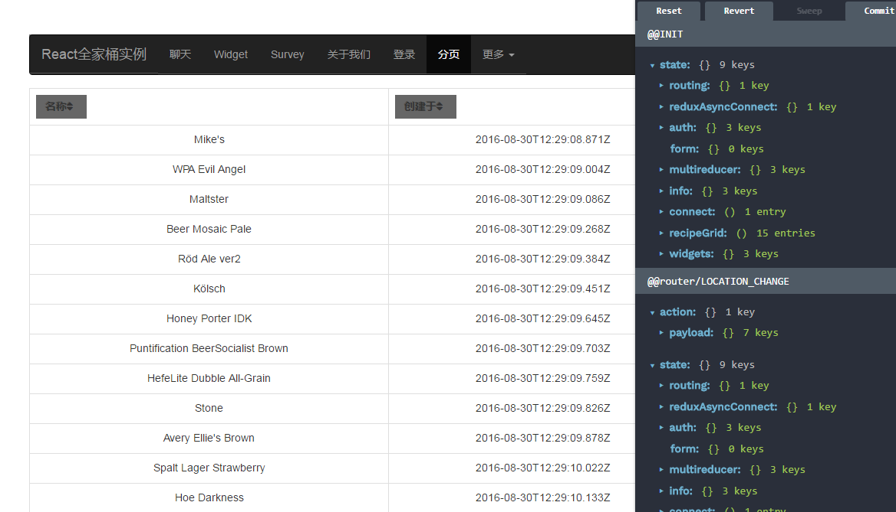

自已以前对redux,react,rect-redux,react-router都是有一点的了解，但是不足的地方在于没有做一个demo将他们串起来,所以总是感觉似懂非懂。所以我最后写了这个例子，希望有同样困扰的同学能够有所收益。也欢迎star,issue

#### 1.项目效果
```js
git clone https://github.com/liangklfangl/react-universal-bucket.git
npm install 
npm run dev
//开发模式下运行下面的命令
//npm run pro
```
打开http://localhost:3222/ 就可以看到效果。项目截图如下：




#### 2.项目基本知识点
##### 2.1 代理与反代理的基本内容
使用http-proxy来完成。其反向代理的原理如下图：


通过如下代码完成，其相当于一个反向代理服务器，向我们的代理服务器，即API服务器发送请求:
```js
const targetUrl = 'http://' + (process.env.APIHOST||"localhost") + ':' + (process.env.APIPORT||"8888");
//其中APIHOST和APIPORT分别表示API服务器运行的域名与端口号
const proxy = httpProxy.createProxyServer({
  target:targetUrl,
  ws:true
  //反代理服务器与服务器之间支持webpack socket
});
app.use("/api",(req,res)=>{
  proxy.web(req,res,{target:targetUrl});
});
app.use('/ws', (req, res) => {
  proxy.web(req, res, {target: targetUrl + '/ws'});
});
```

##### 2.2 react全家桶常见库
react-router,react,redux,react-redux,redux-async-connect,redux-thunk等一系列react相关的基本内容。其中最重要的就是我们的redux-async-connect，他可以在跳转到某个页面之前或者之后发起某一个ajax请求。用法如下:
```js
@asyncConnect([{
  //其中helpers来自于服务端渲染
  promise: ({store: {dispatch, getState},helpers}) => {
  const promises = [];
  const state = getState();
  //得到store的当前状态
  if(!isInfoLoaded(state)){
    promises.push(dispatch(loadInfo()));
  }
  if(!isAuthLoaded(state)){
    promises.push(dispatch(loadAuth()));
  }
  //如果没有登录或者相应的数据没有加载完成，那么我们在此时加载数据
   return Promise.all(promises);
  }
}])
```
其中helpers方法来自于其服务端渲染的loadOnServer方法:
```js
   loadOnServer({...renderProps, store, helpers: {client}}).then(() => {
        const component = (
          <Provider store={store} key="provider">
            <ReduxAsyncConnect {...renderProps} />
          <\/Provider>
        )
        res.status(200);
        global.navigator = {userAgent: req.headers['user-agent']};
        res.send('<!doctype html>\n' +
          renderToString(<Html assets={webpackIsomorphicTools.assets()} component={component} store={store}\/>));
      });
```
对于上面的promise方法的用法不理解的可以参考[这里](http://blog.csdn.net/liangklfang/article/details/72847616)

##### 2.3 自定义bootstrap
使用bootstrap-loader来加载自定义的bootstrap文件(.bootstraprc)，从而减小打包后文件的大小。我们通过在项目目录下建立.bootstraprc文件，该文件可以指定我们需要使用的bootstrap样式，是否使用javascript等。如通过下面的配置：
```js
scripts: false
```
就可以在当前应用中不引入bootstrap的javascript，而只是单独使用样式。如果在单独使用样式的情况下我们可以结合react-bootstrap，react-router-bootstrap来完成页面的各种交互。如果你要单独使用这部分的内容，你可以[参考这里](https://github.com/liangklfangl/bootstrap-loader-demo/tree/daily/0.0.1)

##### 2.4 webpack的HMR功能集成
使用webpack实现HMR(react-transform-hmr)等基本功能，以及介绍了webpack-dev-middleware，webpack-hot-middleware等的使用。
```js
 babelReactTransformPlugin[1].transforms.push({
      transform: 'react-transform-hmr',
      imports: ['react'],
      locals: ['module']
    });
```
如果你想深入了解HMR，你也可以[参考这里](https://github.com/liangklfangl/webpack-dev-server)。

##### 2.5 redux开发工具使用
redux-devtools,redux-devtools-dock-monitor,redux-devtools-log-monitor等redux开发工具的使用。只需要添加下面的一段代码就可以了:
```js
import React from 'react';
import { createDevTools } from 'redux-devtools';
import SliderMonitor   from "redux-slider-monitor";
import LogMonitor from 'redux-devtools-log-monitor';
import DockMonitor from 'redux-devtools-dock-monitor';
export default createDevTools(
  <DockMonitor changeMonitorKey='ctrl-m' defaultPosition="right"  toggleVisibilityKey="ctrl-H"
               changePositionKey="ctrl-Q">
    <LogMonitor />
    <SliderMonitor  keyboardEnabled />
  <\/DockMonitor>
);
```
当然，如果要添加这部分代码要做一个判断:
```js
if (__DEVELOPMENT__ && __CLIENT__ && __DEVTOOLS__) {
    const { persistState } = require('redux-devtools');
    const DevTools = require('../containers/DevTools/DevTools');
    finalCreateStore = compose(
      applyMiddleware(...middleware),
      window.devToolsExtension ? window.devToolsExtension() : DevTools.instrument(),
      //如果有window.devToolsExtension，那么使用用户自己的，否则使用我们配置的
      persistState(window.location.href.match(/[?&]debug_session=([^&]+)\b/))
    )(_createStore);
  }
```
也就是说我们只会在开发模式下，同时客户端代码(服务端显然是不需要的，该工具只是为了在客户端查看当前state的状态)中，以及__DEVTOOLS__为true中才会添加我们的devTool工具。

##### 2.6 react服务器端同构
服务端同构是react开发中不可避免的问题，因为服务端渲染在一定程度上能够减少首页白屏的时间，同时对于SEO也具有很重要的作用。React中关于服务端渲染的介绍只是给出一个match方法，而更加深入的知识却要自己反复琢磨。
```js
match({ history, routes: getRoutes(store), location: req.originalUrl }, (error, redirectLocation, renderProps) => {
    if (redirectLocation) {
      res.redirect(redirectLocation.pathname + redirectLocation.search);
      //重定向要添加pathname+search
    } else if (error) {
      console.error('ROUTER ERROR:', pretty.render(error));
      res.status(500);
      hydrateOnClient();
    } else if (renderProps) {
      loadOnServer({...renderProps, store, helpers: {client}}).then(() => {
        const component = (
          <Provider store={store} key="provider">
            <ReduxAsyncConnect {...renderProps} />
          <\/Provider>
        );
        res.status(200);
        global.navigator = {userAgent: req.headers['user-agent']};
        res.send('<!doctype html>\n' +
          renderToString(<Html assets={webpackIsomorphicTools.assets()} component={component} store={store}\/>));
      });
    } else {
      res.status(404).send('Not found');
    }
  });
});
```
针对这部分内容我写了[react服务端渲染中的renderProps与react-data-checksum](https://github.com/liangklfangl/react-router-renderProps)以及[React服务端同构深入理解与常见问题](https://github.com/liangklfangl/react-static-ajax)等系列文章，也欢迎阅读。文中提到了webpack-isomorphic-tools，该工具使得在服务端也能够处理less/css/scss,image等各种文件，从而使得服务端同构成为现实(服务端可以使用css module等特性生成className，从而使得checksum在客户端与服务端一致，防止客户端重新渲染)。

##### 2.7 各种打包工具
better-npm-run以及[webpackcc](https://github.com/liangklfangl/wcf)等打包工具的使用。前者在package.json中直接配置就行:
```js
"betterScripts": {
    "start-prod": {
      "command": "node ./bin/server.js",
      "env": {
        "NODE_PATH": "./src",
        "NODE_ENV": "production",
        "PORT": 8080,
        "APIPORT": 3030
      }
    }
}
```
其主要作用在于方便设置各种环境变量。而webpackcc集成了多种打包方案，总有一个适合你

##### 2.8 服务端客户端其他的库
superagent,express等与服务器相关的内容。其中前者主要用于向服务端发送请求，包括服务端向反向代理服务器以及客户端向服务器发送请求。
```js
const methods = ['get', 'post', 'put', 'patch', 'del'];
import superagent from 'superagent';
 this[method] = (path, { params, data } = {}) => new Promise((resolve, reject) => {
        const request = superagent[method](formatUrl(path));
        if (params) {
          request.query(params);
        }
        //如果传入了参数，那么通过query添加进去
        if (__SERVER__ && req.get('cookie')) {
          request.set('cookie', req.get('cookie'));
        }
        if (data) {
          request.send(data);
        }
        //request.end才会真正发送请求出去
        request.end((err, { body } = {}) => err ? reject(body || err) : resolve(body));
      }));
```

#### 3.你能够学到的东西
内部所有的代码都有详细的注释，而且都给出了代码相关说明的链接。通过这个项目，对于react*全家桶*应该会有一个深入的了解，如果你有不懂的地方，也可以通过github上的邮箱联系我。希望我们能够共同进步